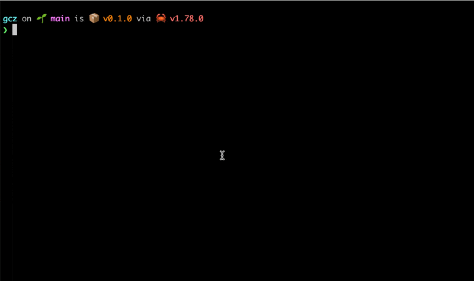

# gcz

[](https://github.com/kazu728/gcz/actions/workflows/test.yml)

**gcz** is a command-line tool that simplifies Git commit processes by providing an interactive interface for selecting commit types and composing commit messages following the conventional commits standard.

## Features



- **Interactive Commit Type Selection**: Choose from predefined commit types like `feat`, `fix`, `docs`, `style`, `refactor`, `perf`, `test`, `ci`, and `chore`.
- **Real-time Filtering**: Filter commit types by typing keywords.

## Installation

<!-- TODO: after publishing -->

<!-- ### Build from Source

1. **Clone the Repository**

   ```bash
   git clone https://github.com/yourusername/gcz.git
   cd gcz
   ```

2. **Build the Project**

   ```bash
   cargo build --release
   ```

3. **Add to PATH**

   Move the executable to a directory in your `PATH`. For example:

   ```bash
   sudo mv target/release/gcz /usr/local/bin/
   ``` -->

## Usage

Navigate to your Git repository and run:

```bash
gcz
```

### Command-line Options

- `-e`, `--emoji`: _(Work in Progress)_ Add emojis to the commit template.

## Testing

Run the following command to execute tests:

```bash
cargo test
```
